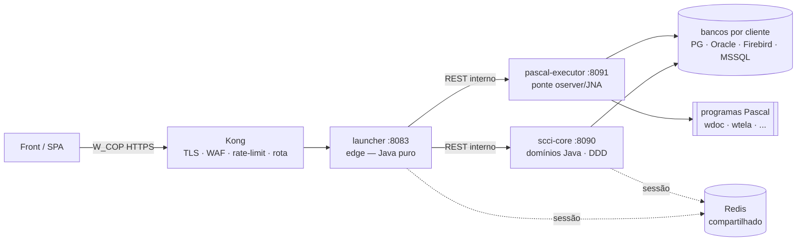
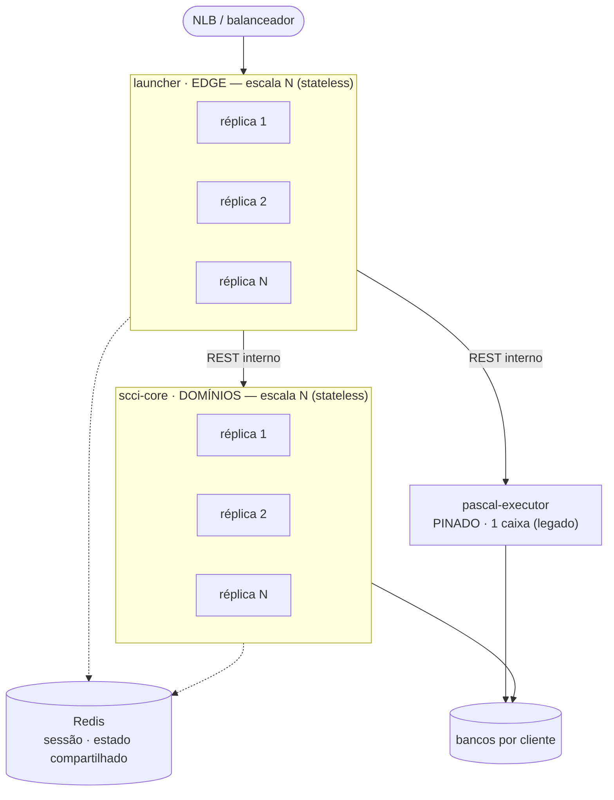

# SCCI Launcher

> Migração do launcher SCCI (daemon **Pascal**/oserver) para uma **plataforma Java hexagonal** —
> _Strangler Fig_, sem parar produção.


O launcher legado está sendo transformado numa plataforma modular: uma **borda fina** (edge) em Java
na frente, os **domínios em Java** num monólito modular, e o que **ainda é Pascal** isolado atrás de um
serviço próprio. Cada peça é trocável por **feature-flag**, com _fallback_ — dá para migrar um método
de cada vez sem interromper o serviço, preservando o contrato do front (`/aejs-l`) byte-a-byte.

---

## Arquitetura



O front fala **só** com o `launcher` (atrás do **Kong**: TLS, WAF, rate-limit, roteamento). Ele não
contém regra de negócio: transporta o **W_COP**, decide por _feature-flag_ quem atende cada chamada e
delega — para o `scci-core` (domínios já em Java) ou para o `pascal-executor` (o que ainda é Pascal). O
estado de sessão vive no **Redis compartilhado** entre `launcher` e `scci-core`.

### Como escala

`launcher` e `scci-core` são **stateless** (todo o estado está no Redis e nos bancos) → escalam em **N
réplicas** atrás de um balanceador. O `pascal-executor` é **pinado** à caixa legada (precisa dos binários
Pascal + oserver em disco) e **encolhe** conforme os domínios migram, até ser desligado.



---

## Módulos

```
scci-launcher/
├── common/            libs técnicas compartilhadas (in-process, usadas pelos apps)
│   ├── crypto             W_COP — AES no request, XOR na resposta
│   ├── environment        leitor do launcherenv.ini + JDBC multi-banco
│   └── contract           contratos compartilhados
│
├── launcher/          a BORDA (edge / gateway) — Java puro, sem código nativo
│   ├── domain             modelos + portas
│   ├── application        gate de sessão + roteadores Strangler
│   ├── adapters-in        controllers /w/*, /sccidoc
│   ├── adapters-out       clientes REST (scci-core, pascal-executor), Redis, SCCI_SESSION
│   └── bootstrap          Spring Boot main + wiring (:8083)
│
├── scci-core/         o MONÓLITO MODULAR (DDD) — domínios Java, escalável
│   ├── acesso             login (BANCO + família B), senha, recuperação, valida
│   ├── sessao             ciclo de vida da sessão (Redis + SCCI_SESSION)
│   ├── documentos         ver / baixar / enviar (FileSystem + BLOB)
│   ├── notificacao        e-mail / SMTP (reaproveitável)
│   ├── kernel             infra JDBC multi-banco + drivers
│   └── bootstrap          Spring Boot main + wiring (:8090)
│
└── pascal-executor/   a ÂNCORA LEGADA — ponte oserver/JNA (único módulo nativo)
                        socketpair + posix_spawn no fd 6 → spawna os "w" Pascal (:8091)
```

Cada contexto do `scci-core` tem sua **hexagonal interna** (`domain` / `application` / `adapters/in` /
`adapters/out`). No `launcher`, a hexagonal é **por módulo Maven** — a fronteira é imposta pelo build.
Regra DDD: um contexto só referencia a **porta** do outro, nunca a entidade.

---

## Papel de cada peça

### `launcher` — a borda (edge / gateway)
**Papel:** ser o **único ponto de entrada** e um **tradutor/orquestrador** — recebe o mundo do front e
decide para onde vai cada chamada. É deliberadamente **fino**.

- **Faz:** termina o protocolo **W_COP** (decifra request / cifra resposta); mantém o **gate de sessão**
  (valida o token lendo o Redis a cada requisição); **decide por feature-flag** quem atende
  (`scci-core` ou `pascal-executor`) e **delega**; expõe os canais do front (`/w/*`, `/sccidoc`).
- **Não faz:** **regra de negócio** (nenhuma), acesso a banco de domínio, nem código **nativo/JNA** — é
  Java puro. Se um backend cair, aplica _fallback_.

### `scci-core` — o cérebro (domínios em Java)
**Papel:** ser o **dono da regra de negócio** migrada. Um **monólito modular** onde cada _bounded
context_ (`acesso`, `sessao`, `documentos`, `notificacao`) encapsula suas regras, dados e portas.

- **Faz:** autentica (login/senha/família B), gerencia o ciclo de sessão, lê/grava documentos
  (FileSystem + BLOB), envia notificações; abre as conexões **JDBC multi-banco** por ambiente.
- **Não faz:** transporte W_COP nem roteamento do front — ele só é chamado (REST interno) pelo edge.
  **Stateless** → escala em N réplicas.

### `pascal-executor` — a âncora legada
**Papel:** **isolar tudo que ainda é Pascal/nativo** num só lugar. É a ponte para o mundo legado, que
**encolhe** conforme os domínios migram — até poder ser **desligado**.

- **Faz:** a ponte **oserver/JNA** (`socketpair` + `posix_spawn` no fd 6) que **spawna os programas "w"**
  (wdoc, wtela, …) e fala o protocolo de blocos do oserver; expõe isso por REST interno.
- **Não faz:** nenhuma regra nova — só executa o binário Pascal real. É o **único** módulo com JNA;
  fica **pinado** à caixa onde estão os binários + `ambiente/` + oserver.

### `common` — as ferramentas compartilhadas
**Papel:** guardar as **capacidades técnicas** que os apps usam **in-process**, sem regra de domínio —
para não duplicar entre launcher e scci-core.

- **Faz:** `crypto` (W_COP: AES no request, XOR na resposta); `environment` (lê o `launcherenv.ini` e
  monta a conexão JDBC por `DRIVERNAME`); `contract` (contratos compartilhados).
- **Não faz:** nada de negócio nem de transporte — é **biblioteca** (jar), não um serviço.

---

## Stack

| Camada | Tecnologia |
| --- | --- |
| Linguagem | **Java 21** |
| Framework | **Spring Boot 3.3.4** (Web, Actuator, Data Redis, Mail) |
| Build | **Maven** (monorepo multi-módulo) |
| Arquitetura | **Hexagonal** (Ports & Adapters) · **DDD** · **Strangler Fig** |
| Persistência | JDBC **multi-banco** — Postgres, Oracle, Firebird, MSSQL (por `DRIVERNAME`) |
| Sessão / cache | **Redis** (compartilhado entre launcher e scci-core) |
| Cripto | **W_COP** — AES-128 no request, XOR/ISO-8859-1 na resposta; senha bcrypt + md5crypt |
| Relatórios | **JasperReports** (lib Java) · imagem→PDF (openpdf) |
| Legado | **Pascal** via oserver (JNA: `socketpair` + `posix_spawn`) |
| Observabilidade | logs **JSON estruturado** (logstash) · **OTLP** (métricas/traces) |

---

## Como rodar

Pré-requisitos: **JDK 21** e **Maven**.

```bash
# build de tudo (a partir da raiz)
mvn clean package

# subir cada serviço (portas padrão)
java -jar scci-core/bootstrap/target/scci-core.jar          # :8090  (interno)
java -jar pascal-executor/target/pascal-executor.jar        # :8091  (interno, co-localizado com o Pascal)
java -jar launcher/bootstrap/target/launcher.jar            # :8083  (edge)
```

Health de cada serviço em `http://localhost:<porta>/actuator/health`.
Os scripts de deploy (empacotamento com JDK embutido + envio por SSH) estão em [`deploy/`](deploy/).

### Portas

| Serviço | Porta | Exposto ao front |
| --- | --- | --- |
| `launcher` | **8083** | sim (atrás do Kong) |
| `scci-core` | **8090** | não (REST interno) |
| `pascal-executor` | **8091** | não (REST interno) |

---

## Feature flags (Strangler)

Cada canal do `launcher` é um **decorator** (roteador) que, por flag, escolhe o caminho **JAVA**
(`scci-core`) ou o **legado** (Pascal). Sem entrada = comportamento antigo; com o backend fora, cai no
_fallback_. As flags vivem no mapa `launcher.roteamento.flags` (chave com ponto usa notação de colchetes):

```yaml
launcher:
  roteamento:
    flags:
      "[documentos.GetDocumento]": { habilitado: true }   # download por ID -> scci-core
      "[acesso.Login]":            { habilitado: true }   # /w/login       -> scci-core
```

A chave é o **nome consultado** pelo roteador: `dominio.<Metodo>` (override por método) **vence**
`dominio` (default do domínio); sem entrada = **legado**.

### Exemplos já aplicados (validados ao vivo)

| Flag | Estado | Roteia | Validação |
| --- | --- | --- | --- |
| `documentos.GetDocumento` | **ON** | download de documento por ID → `scci-core` | PDF **byte-idêntico** ao legado (FileSystem + zlib) |
| `acesso.Login` | **ON** | `/w/login` → `scci-core/acesso` | login real (supervisor) autenticado + sessão validada pelo gate |
| _execução Pascal_ | **fixo** | **sempre** via `pascal-executor` | não é mais flag — launcher virou Java puro |

Disponíveis, ainda **em legado** (é só ligar quando validar): `acesso.TrocaSenha`, `acesso.EmailPwd`,
`acesso.ValidaAcesso`, `documentos.PostDocumento`, ou o domínio inteiro (`documentos`, `acesso`).

A flag carrega um campo `percentual`, então a evolução natural é **canary / rollout gradual**
(10% → 50% → 100%) ou decisão **por ambiente/cliente** — mudando só o roteador.

---

## Status da migração

| Já em Java (scci-core) | Ainda Pascal (via pascal-executor) |
| --- | --- |
| **documentos** — download (FileSystem + BLOB) e upload | demais métodos do wdoc/wtela/... |
| **acesso** — login BANCO + família B (7 clientes), senha, valida | relatórios e fluxos que ainda batem no oserver |
| **sessao** — Redis + SCCI_SESSION | |
| **notificacao** — e-mail/SMTP | |
| **execução** — externalizada; launcher virou **Java puro** | _ao fim: desligar o pascal-executor_ |

---

## Invariantes de segurança

- **Login = somente leitura** no banco do cliente (sem rehash md5crypt→bcrypt).
- **W_COP fica na borda**; a comunicação interna trafega texto na rede confiável.
- **Produção intocada** — toda a migração corre no trilho paralelo `/aejs-l`.
- **Redis: contrato idêntico** de chave/serialização entre launcher (gate) e scci-core (ciclo de vida).
- **Ir ao ar por cliente** exige o endpoint/credenciais **daquele** cliente; escrita só em ambiente nomeado.

---

<sub>Plataforma SCCI · `common` · `launcher` · `scci-core` · `pascal-executor` — arquitetura hexagonal, Strangler Fig.</sub>
