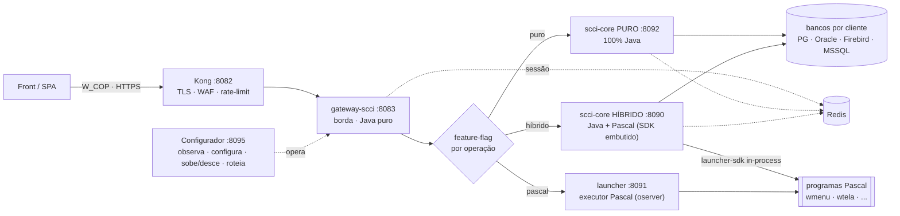
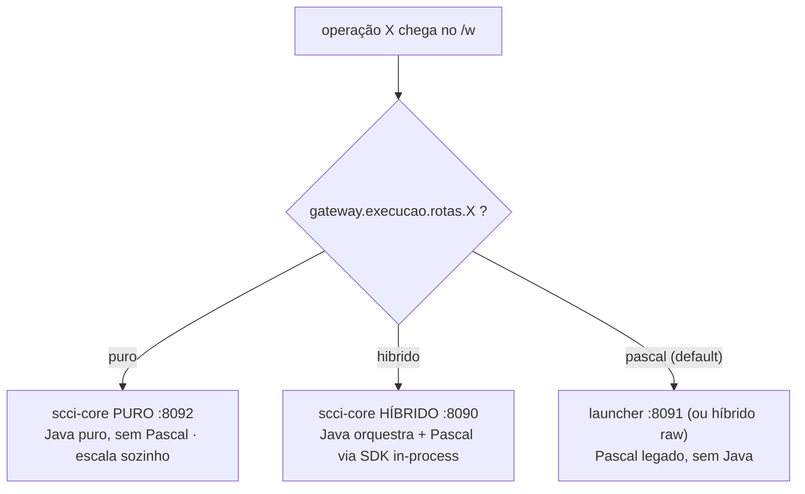
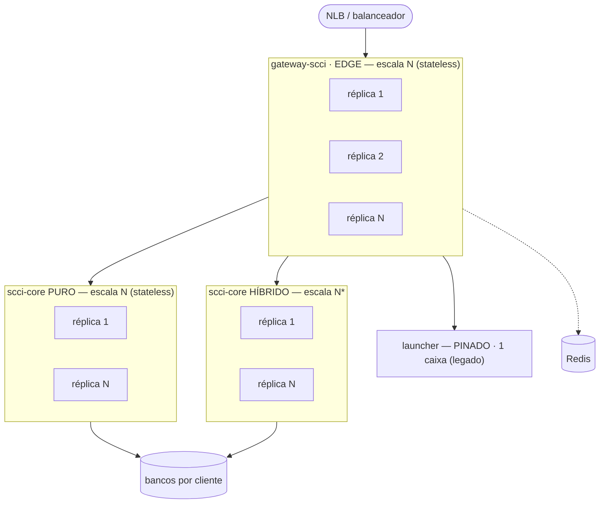
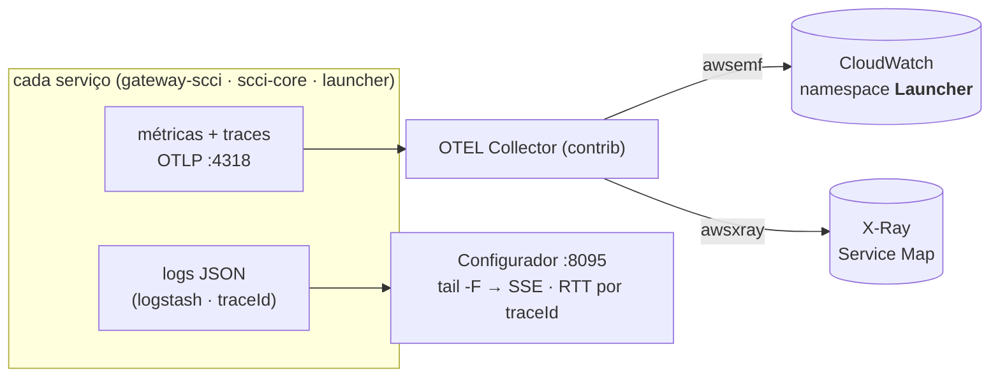

# SCCI · Plataforma Java

> Migração do launcher SCCI (daemon **Pascal**/oserver) para uma **plataforma Java hexagonal** —
> _Strangler Fig_, migrando **operação por operação** sem parar produção.


Uma **borda fina** (o `gateway-scci`) recebe o front e decide, **por feature-flag e por operação**, um de
**três trilhos**: **Java puro**, **híbrido** (Java que ainda chama Pascal) ou **Pascal** legado. Cada operação
migra virando uma flag — sem interromper o serviço e preservando o contrato do front (`/w`, `/aejs-l`) byte-a-byte.

---

## Arquitetura



O front fala **só** com o `gateway-scci` (atrás do **Kong**). Ele **não tem regra de negócio**: termina o
**W_COP**, valida a **sessão** (Redis) e, por **feature-flag**, escolhe o trilho de cada operação e delega. O
estado de sessão vive no **Redis** compartilhado.

---

## Os 3 trilhos (Strangler)

O coração da migração. Para cada operação (`/w` → `programName`), o gateway consulta a flag e roteia:



| Trilho | Onde roda | Quando |
| --- | --- | --- |
| **puro** | `scci-core` **PURO** (`:8092`, `SCCI_SDK=false`) | operação **100% migrada** para Java |
| **hibrido** | `scci-core` **HÍBRIDO** (`:8090`, `SCCI_SDK=true`) | **parcial** — Java orquestra e ainda chama Pascal (via `launcher-sdk` embutido) |
| **pascal** | `launcher` (`:8091`) ou o híbrido raw | **não migrado** — só o binário Pascal (o **default**) |

Config (dirige o roteamento, sem deploy — também editável na aba **Serviços → Roteamento** do Configurador):

```yaml
gateway:
  execucao:
    rota-default: pascal            # quem não tem flag = legado (comportamento antigo)
    rotas:
      login:  puro                  # 100% Java     → scci-core PURO
      wmenu:  hibrido               # Java + Pascal  → scci-core HÍBRIDO
      wtelas: pascal                # legado         → launcher
```

Prioridade **puro > híbrido > pascal**. Vira a flag e a operação muda de trilho. O `scci-core` é o **mesmo
artefato** nos dois modos — só muda a flag `SCCI_SDK` no deploy (embute ou não o `launcher-sdk`).

### Como escala

`gateway-scci`, `scci-core` (puro/híbrido) são **stateless** (estado no Redis + bancos) → escalam em **N
réplicas**. O `launcher` (executor Pascal) é **pinado** à caixa legada (precisa dos binários Pascal + oserver
em disco) e **encolhe** conforme as operações migram para `puro`/`híbrido`, até poder ser **desligado**.



<sub>*híbrido escala, mas cada réplica precisa dos binários Pascal + oserver co-localizados (via UDS+shim ou JNA).</sub>

---

## Módulos

```
launcher/  (monorepo Maven)
├── common/         libs técnicas compartilhadas (in-process)
│   ├── crypto          W_COP — AES no request, XOR na resposta
│   ├── environment     leitor do launcherenv.ini + JDBC multi-banco
│   └── contract        contratos compartilhados
│
├── launcher-sdk/   a CAPACIDADE "rodar Pascal" (reutilizável) — ponte oserver
│                   socketpair/UDS + posix_spawn no fd 6 → spawna os "w" Pascal.
│                   Embutido no scci-core HÍBRIDO; roda também standalone no launcher.
│
├── gateway-scci/   a BORDA (edge) — Java puro, sem código nativo
│   ├── domain          modelos + portas (inclui RotaExecucaoRegistry)
│   ├── application     gate de sessão + RoteadorExecucao (3 trilhos)
│   ├── adapters-in     controllers /w, /w/login, /sccidoc
│   ├── adapters-out    clientes REST (puro/híbrido/pascal), Redis, ConfigRotaExecucao
│   └── bootstrap       Spring Boot main + wiring (:8083)
│
├── scci-core/      o MONÓLITO MODULAR (DDD) — domínios Java + SDK opcional
│   ├── acesso          login, senha, recuperação, valida
│   ├── sessao          ciclo de vida da sessão (Redis + SCCI_SESSION)
│   ├── documentos      ver / baixar / enviar (FileSystem + BLOB)
│   ├── notificacao     e-mail / SMTP
│   └── bootstrap       main + /interno/executar unificado (:8090 híbrido / :8092 puro)
│
└── launcher/       o EXECUTOR Pascal standalone — âncora legada (:8091)
                    o mesmo launcher-sdk exposto por REST (/interno/executar)
```

O `scci-core` unifica os três trilhos num só endpoint (`/interno/executar`): se a operação está no
**registro Java** → roda Java (puro); senão, se o **SDK está presente** (`SCCI_SDK=true`) → roda Pascal
in-process (híbrido); senão → responde _"não migrada"_.

---

## Configurador (`:8095`)

Ferramenta **standalone** (Node puro, sem dependências, servida como **1 arquivo**) para **operar** o
ambiente — código em [`configurador/`](configurador/). Capacidades:

| Aba | O que faz |
| --- | --- |
| **Métricas** | vazão, latência, falhas/timeouts, presas e repetidas — em tempo real, do stream de log |
| **RTT — "a viagem da requisição"** | cada chamada decomposta pelo **tempo próprio de cada componente** (gateway + scci-core + Pascal = total), correlacionada por `traceId`, com o **trilho** (puro/híbrido/pascal) por chamada. **Nada é lido do banco.** |
| **Serviços** | **liga/desliga/reinicia** cada serviço; **switch de roteamento** (pascal → launcher × híbrido); **roteamento por operação** (vira as flags `puro/híbrido/pascal` por programa) |
| **Configuração** | todos os parâmetros dos `yml` com **valor efetivo + origem**, **editar → salvar → aplicar** (grava um *override* e reinicia só aquele serviço, sem tocar no arquivo original); listbox nos enums; caminho do arquivo em disco |
| **Sessões** | sessões vivas por ambiente (token real no Redis) |
| **Logs** | stream ao vivo dos `app.log` (JSON), clicável p/ ver todos os campos |
| **Auditoria** | quem fez o quê (login, save, apply, power, rota) |

Sobe os serviços já **no modo certo** (env por papel, `ulimit -u` alto, ordem correta). Empacotável em
**1 arquivo** (`node bundle.js` → `configurador.bundle.js`) + instalador de 1 comando.

---

## Observabilidade · logs · envio de logs

**Logs** — cada serviço emite **JSON estruturado** (logstash-logback) com `traceId`/`spanId` em toda linha.
Eventos-chave: `http_request` (edge, `duracaoMs`), `w_dispatch` (com o `trilho` escolhido), `sdk_hibrido_*`
e `program_exec` (tempo do Pascal, `ms`), `java_puro` (módulo Java + `ms`). O **Configurador** faz `tail -F`
→ **SSE** e, no RTT, **correlaciona pelo `traceId`** para montar a viagem ponta-a-ponta (o gateway loga só
com `requestId` fora do span, então há uma ponte `requestId → traceId`).

**Envio de logs / telemetria (AWS)** — métricas e traces saem por **OTLP** (`:4318`) para um **OTEL
Collector** (contrib), que exporta:



- **CloudWatch** (via EMF, `namespace: Launcher`) — métricas: latência, vazão, `pascal.roundtrip`, `pascal.spawn`.
- **X-Ray** — traces distribuídos (Service Map ponta-a-ponta gateway → scci-core → Pascal).
- Config em [`deploy/observability/`](deploy/observability/); o collector precisa de `AWS_REGION` + credenciais
  (CloudWatch EMF + `xray:PutTraceSegments`).

---

## Configuração (principais chaves)

Tudo editável no Configurador (aba Configuração) ou nos `yml`/env. As mais importantes:

| Chave | O que faz |
| --- | --- |
| `SCCI_SDK` (`scci.sdk.habilitado`) | modo do scci-core: `true` = **híbrido** (embute o SDK, roda Pascal); `false` = **puro** |
| `executor.transporte` | como o Java fala com o Pascal: `jna` (ponte atual) ou `uds` (UDS+shim v2, **VT-friendly**) |
| `executor.shim-path` | binário shim (C) usado quando `transporte=uds` |
| `VIRTUAL_THREADS` (`spring.threads.virtual.enabled`) | liga Virtual Threads (Java 21). **Só** com `transporte=uds` (JNA faz _pinning_). Off por padrão |
| `gateway.execucao.rotas.<prog>` / `rota-default` | os **3 trilhos** por operação (`puro`/`hibrido`/`pascal`) |
| `executor.timeout-ms`, `executor.max-concorrentes` | timeout do oserver e semáforo de execuções Pascal (espelha o `MAXCONN`) |
| `launcher.wcop.exigir-cifrado` | exige a requisição cifrada (W_COP) — `true` em produção, `false` em dev |
| `launcher.auth.*` / `.policy.*` | política de login e de senha (max-erros, CAPTCHA, mínimos, etc.) |
| `common.environment.cache-*` | cache da config por ambiente (a **credencial nunca** é cacheada) |

---

## Stack

| Camada | Tecnologia |
| --- | --- |
| Linguagem | **Java 21** (+ **Node** puro no Configurador) |
| Framework | **Spring Boot 3.3.4** (Web, Actuator, Data Redis, Mail) |
| Build | **Maven** (monorepo multi-módulo) |
| Arquitetura | **Hexagonal** (Ports & Adapters) · **DDD** · **Strangler Fig** (3 trilhos) |
| Persistência | JDBC **multi-banco** — Postgres, Oracle, Firebird, MSSQL (por `DRIVERNAME`) |
| Sessão / cache | **Redis** (compartilhado) |
| Cripto | **W_COP** — AES-128 no request, XOR/ISO-8859-1 na resposta |
| Legado | **Pascal** via oserver — transporte **JNA** (`socketpair`+`posix_spawn`) ou **UDS+shim** (v2) |
| Observabilidade | logs **JSON** (logstash · `traceId`) · **OTLP** → OTEL Collector → **CloudWatch** + **X-Ray** |

---

## Portas

| Serviço | Porta | Exposto ao front |
| --- | --- | --- |
| `gateway-scci` (borda) | **8083** | sim (atrás do Kong :8082) |
| `scci-core` **híbrido** | **8090** | não (REST interno) |
| `scci-core` **puro** | **8092** | não (REST interno) |
| `launcher` (executor Pascal) | **8091** | não (REST interno) |
| `Configurador` | **8095** | ferramenta de operação |
| Kong | **8082** | entrada TLS/WAF |

---

## Como rodar

Pré-requisitos: **JDK 21** e **Maven**.

```bash
mvn clean package                                     # build de tudo (a partir da raiz)

java -jar gateway-scci/bootstrap/target/gateway-scci.jar   --server.port=8083            # borda
SCCI_SDK=true  java -jar scci-core/bootstrap/target/scci-core.jar --server.port=8090     # scci-core HÍBRIDO
SCCI_SDK=false java -jar scci-core/bootstrap/target/scci-core.jar --server.port=8092     # scci-core PURO
java -jar launcher/bootstrap/target/launcher.jar           --server.port=8091            # executor Pascal
```

Health em `http://localhost:<porta>/actuator/health`.

### Deploy / desenv

- **Subir tudo integrado na desenv com 1 clique**: [`deploy/desenv/`](deploy/desenv/) →
  `subir-desenv.bat` (Windows) ou `subir-desenv.sh` (Linux). Sobe Configurador → backends → gateway, na
  ordem, sob `ulimit -u` alto, idempotente.
- **Pacotes por serviço** (JDK embutido + envio por SSH + Kong): [`deploy/`](deploy/).
- **Gotcha da desenv** (custa horas): o `ulimit -u` (nproc) do usuário é **200** — vários JVMs estouram
  (`unable to create native thread`) e até **travam o login SSH**. Suba sempre com `ulimit -u` alto
  (o Configurador e os scripts já fazem). Fix definitivo: infra subir o `nproc` no `limits.conf`.

---

## Invariantes de segurança

- **Login = somente leitura** no banco do cliente (sem rehash de senha).
- **W_COP fica na borda**; a comunicação interna trafega em rede confiável.
- **Produção intocada** — a migração corre no trilho paralelo (`/aejs-l`, `/w`).
- **Redis: contrato idêntico** de chave/serialização entre gateway (gate) e scci-core (ciclo de vida).
- **Ir ao ar por cliente** exige o endpoint/credenciais **daquele** cliente; escrita só em ambiente nomeado.
- **Virtual threads só com UDS** — com JNA há _pinning_ do carrier (trava a escalabilidade).

---

<sub>Plataforma SCCI · `common` · `launcher-sdk` · `gateway-scci` · `scci-core` (puro/híbrido) · `launcher` — hexagonal, Strangler Fig por operação.</sub>
