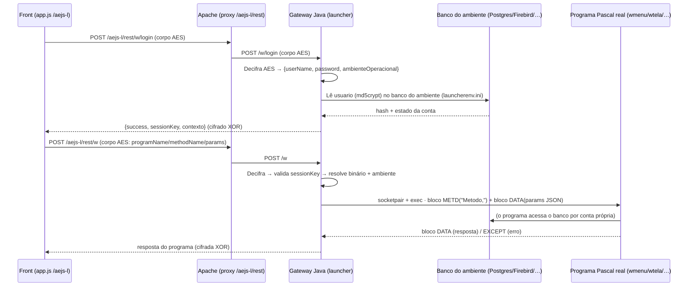

# Regras de Negócio — Launcher Java (Gateway) · `/aejs-l`

> Documento vivo. Registra **o que o gateway (launcher em Java) faz**, com foco nas **regras
> de negócio**, no que **foi implementado / substituído / apenas chamado**, e nas decisões
> **não-óbvias** descobertas no caminho. Serve para análise e para guiar a implementação.
>
> **Princípio central:** o gateway é o **launcher** — ele **orquestra** (recebe, decifra,
> valida sessão, executa programas, devolve). Ele **NÃO contém a lógica dos programas**
> (`wmenu`, `wtela`, `wpretendente`…): esses **binários Pascal reais são executados**, como
> o launcher já faz. A única regra de negócio **reimplementada em Java** é o **login** (a
> pedido), portado do `loginbd.pas`.

---

## 1. Escopo e isolamento

- Tudo roda no contexto **`/aejs-l`** (cópia de teste). O **`/aejs` real não é tocado**
  (nem a pasta, nem o W_COP). O backend de **dados** (banco) é o mesmo, em **somente leitura**
  no login.
- O Apache faz `ProxyPass /aejs-l/rest → http://127.0.0.1:8082/` (o gateway). O estático
  (`index.html`, `app.js`) continua servido pelo Apache.
- **Pré-requisito de infra:** o `mod_security` (WAF) precisa ser desligado em `/aejs-l/rest`
  (`<Location /aejs-l/rest> SecRuleEngine Off </Location>`), como já é no `/aejs`. Sem isso o
  corpo cifrado do POST é bloqueado (HTTP 400).

## 2. Fluxo (visão geral)



**Componentes (Java):**

| Camada | Classe | Papel |
|---|---|---|
| Cripto W_COP | `legacy/crypto/WcopCrypto` | decifra request AES, cifra resposta XOR |
| Login (Rota A) | `legacy/login/WcopLoginService` + `auth/*` | valida usuário no banco (md5crypt) |
| Conexão por ambiente | `legacy/db/LauncherEnvReader`, `JdbcConnectionFactory`, `SccLoginRepository` | lê `launcherenv.ini`, conecta no banco |
| Despacho/execução | `api/AejsWebController` (`/w/login`, `/w`) + `legacy/exec/ProgramExecutor` | valida sessão e **executa o programa real** |

---

## 3. Regras de negócio — LOGIN (reimplementado em Java, portado do `loginbd.pas`)

Único caso **reimplementado** (a pedido). Fiel ao `ExecutaLoginBD`/`TestaUsuario`:

1. **Conexão por ambiente:** o `ambienteOperacional` (ex.: `/u10/c6bank/suporte/scat112934`)
   aponta para um `launcherenv.ini`, seção **`[USERS]`**, que define o banco e as colunas:
   - `DRIVERNAME` (POSTGRES / INTERBASE=Firebird / ORACLE / MSSQL), `DB`, `DB_HOSTNAME`,
     `DB_USER`, `DB_PASS`, e o mapeamento `USERTABLE/USERFIELD/USERPASSWORD/USERDTVALID/…`.
   - **Não-óbvio:** o **banco varia por cliente** — c6bank é **PostgreSQL**, outros são
     **Firebird**. O gateway tem os 4 drivers e decide pelo `DRIVERNAME`.
2. **Verificação de senha:** `hash_no_banco == md5crypt(senha, '$1$' + salt + '$')`, com
   `salt` = 6 chars do próprio hash (`copy(hash,4,6)`). É o **Unix MD5 crypt** (`$1$…`).
3. **Estados da conta (CodErro):** `E`=expirada, `M`=troca obrigatória, `C`=vai expirar,
   `B`=senha em branco, `T`=ok, `F`=incorreta. Verificação do estado **só depois** de conferir
   a senha (não revela estado para senha errada).
4. **`DB_PASS`:** se vier entre `[...]` é cifrado (`WebDeCrypt` — pares de letras A–P); senão
   é texto puro. Em dev é texto (ex.: `wpostgres`).
5. **Token / `sessionKey`:** o gateway gera um token opaco e guarda a sessão (em memória) para
   validar nas chamadas seguintes. **Substituição:** o `GeraToken`/`getpid` do Pascal não faz
   sentido em Java; geramos um equivalente.
6. **Hardening (do `regras.md`, não do `loginbd`):** atraso anti-brute-force, bloqueio por
   tentativas e captcha. Marcado como **acréscimo** (o `loginbd` não tinha).
7. **Somente leitura:** o login **não altera** o banco (sem re-hash md5crypt→bcrypt).

## 4. Regras — CRIPTOGRAFIA do W_COP (descoberta; não estava óbvia)

- **Request (front → gateway): AES-128-CBC.** Formato `____` + `salt(9 dígitos)` +
  `base64(cifra)`. Chave = `base64decode(mod1("iDajpt6RujmyZhxM7kbVVI==", salt))`,
  IV = `base64decode("8qzYJ7ULNNU6sle9nDAuQg==")` (fixo). `mod1` intercala os 8 primeiros
  dígitos do salt na chave base64 (`pcrypt.pas`). O claro vem com padding `#0`.
- **Response (gateway → front): XOR posicional** (`codifica` do `wcorp.pas`):
  cada byte ASCII vira `byte XOR (0x70 + (j & 15))` (j conta só bytes ASCII); bytes UTF-8
  estendidos passam intactos; prefixo **`.*(@`**.
- **Não-óbvio (acentos):** a resposta deve sair em **ISO-8859-1** (não UTF-8) — senão o front
  mostra `ç` no lugar de `ç`.
- **Contexto** (`CORP_WEB`) vem do `w.ini [Servidor] Contexto`.
- **No login a senha VAI no blob** (dentro do AES) — não aparece em claro.

## 5. Regras — DESPACHO `/w` e EXECUÇÃO dos programas

- No modo CRIPTOGRAFA o front manda **tudo em `POST /w`**, com `programName`/`methodName`/
  `requestMethod` **dentro do blob**. O gateway decifra, **valida a sessão** e executa.
- **Nome do método:** `capitaliza(requestMethod) + capitaliza(methodName)` →
  `GET`+`menu` = **`GetMenu`**; `POST`+`tela` = `PostTela`. (O `wcorp` faz `UpCase`.)
- **Execução = papel do launcher (NÃO reescreve o programa):**
  - Monta o **ambiente** do `launcherenv.ini [ENVIRONMENT]` (SCCIDIR*, HOME, PATH…) + `USER`.
  - Resolve o **binário** (`/u/scci/binfpc/<programa>` ou `binfpc` do ambiente).
  - **Executa** e fala o **protocolo de blocos do `oserver`**.
- **Protocolo de blocos (`oserver.pas`):** `magic(1) + len(4, BIG-ENDIAN/htonl) + dados`
  (zlib se `_Z`). Magics: `F7`=METD_Z `F8`=METD_K_Z `F9`=DATA_Z `FA`=METD `FB`=DATA
  `FC`=METD_K `FD`=EXCEPT `FE`=DEBUG.
  - **Request** = bloco **METD `$FA`** com `"Metodo,"` (com vírgula — o `getword` lê até a
    vírgula) + bloco **DATA `$FB`** com os params em **JSON**.
  - **Resposta** = `DATA $FB` (ou `DATA_Z $F9` zlib) ou `EXCEPT $FD` (erro).

### 5.1 Decisões não-óbvias da execução (importantes)

- **NÃO usar o "modo linha-de-comando"** (`prog 0 Metodo VAR=VAL`): ele **trunca saída grande**
  (~2 KB — usa `write()` bufferizado do Pascal, linha 749 do `oserver.pas`, sem flush) e só
  aceita métodos `PtrProcJson`. Use o **modo pipe/bloco real**.
- **`InitFD` usa UM fd bidirecional** (lê e escreve no mesmo fd) → precisa de **socketpair**
  (pipe simples não serve). Como a JVM não cria socketpair, o `ProgramExecutor` usa uma
  **ponte Python embutida**: `socketpair + fork + exec` do programa no fd 6, relê
  `stdin ↔ socket ↔ stdout`. O gateway monta os blocos e parseia a resposta.
- **Ambiente "limpo":** o `ProcessBuilder` **zera** o env e põe só o do `launcherenv.ini`.
  Com o env completo do shell, o `wmenu` respondia *"sem permissão de logar"*; com o env
  limpo, autoriza. (Provável conflito de variável.)
- **Compressão:** mandando `DATA` **não-comprimido**, o programa responde **não-comprimido**
  (`oserver`: ao receber `DATA_HDR`, faz `ToZ:=false`).
- **Usuário de execução (CRÍTICO):** o launcher real faz **`fpsetreuid(UserId, UserId)`**
  (`launcher.pas:2431`) — **baixa o privilégio para o dono do ambiente** (ex.: `c6bank`/grupo
  do `launcherenv.ini`) antes de executar. O gateway Java roda como **`jaime.vicente`** e
  **não é root**, então **não troca de usuário**. Consequência:
  - **Leituras funcionam** (o usuário do gateway consegue ler banco/arquivos).
  - **Neste ambiente** o usuário do gateway (`jaime.vicente`) **está no grupo do ambiente
    (`sup-sp`)** e o diretório é *group-writable* → **escrita de arquivo funciona** (testado).
    Logo o `setuid` **não é** a causa de "gravar não foi" aqui.
  - **Mas continua relevante** para outros ambientes/usuários (onde o gateway não esteja no
    grupo) e para auditoria por usuário. **Correção real (futura):** rodar o launcher com
    permissão de trocar de UID (root / *helper* setuid) e fazer `setreuid` para o dono do
    ambiente, como o `launcher.pas`.
  - **Causa provável real de "gravar não foi":** a mesma **contenção/concorrência** dos
    dropdowns, ou um erro do método de escrita — agora o gateway **loga a mensagem de erro**
    do programa (`program_exec_erro`) para diagnóstico ao vivo.

## 6. O que foi IMPLEMENTADO / SUBSTITUÍDO / apenas CHAMADO

| Item | Status |
|---|---|
| Login (`loginbd`) | **Reimplementado em Java** (md5crypt + estados + multi-banco + hardening) |
| Troca de senha (`loginbd` PASSWD / `ExecutaPasswdBD`) | **Reimplementada em Java** (verifica atual → política → rodízio `NO_SENHA1..5` → grava md5crypt rotacionando histórico; escrita real no banco) |
| Cripto W_COP (AES/XOR) | **Reimplementada** (decifra request / cifra resposta) |
| Despacho `/w` | **Implementado** (decifra, roteia por programName/methodName) |
| `wmenu`, `wtela`, `wpretendente`, … | **CHAMADOS** (binários reais; nenhuma lógica copiada) |
| Menu "mock" inicial | **Removido** (era placeholder; substituído pela execução real) |
| Modo linha-de-comando | **Descartado** (trunca; trocado pelo modo pipe/bloco) |

### 6.1 Por que deixamos de usar o oserver (a fronteira)

O **oserver** é a biblioteca de runtime que o daemon Pascal usa para **dois** papéis bem
distintos. A migração separou esses papéis — e é só por isso que conseguimos "sair" do oserver
em parte do fluxo sem reescrever os programas de negócio:

1. **Papel de autenticação (família `login`: login + troca de senha).** Aqui o oserver/`loginbd`
   só fazia **lógica de banco** — ler a senha, comparar md5crypt, aplicar validade/rodízio,
   gravar a nova. É lógica pura, sem estado de tela. **Essa parte foi reimplementada em Java**
   (`WcopLoginService`, `WcopPasswordService` + repositórios JDBC). Resultado: para login e troca
   de senha **o oserver não é mais chamado** — o gateway fala direto com o Postgres/Firebird/etc.
   do ambiente. Foi uma decisão deliberada porque (a) são poucas regras, (b) já estavam mapeadas
   no `loginbd.pas`, e (c) tirá-las do binário nos deu multi-banco + hardening (bloqueio/captcha/
   atraso) sem tocar no código legado.

2. **Papel de transporte + execução dos programas "w" (`wmenu`, `wtela`, `wpretendente`, …).**
   Aqui o oserver **não é lógica de negócio** — é o **protocolo de blocos** (`magic + len(htonl) +
   data`, zlib, métodos `METD`/`DATA`, verbo+método → `GetMenu`) que carrega entrada e saída por
   **um fd bidirecional** (`InitFD`/socketpair). A lógica de negócio mora **dentro dos binários**,
   que não foram migrados. **Nesse caminho o oserver continua em uso** — apenas **trocamos quem
   fala o protocolo**: em vez do daemon, o gateway abre o programa real e conversa com ele pela
   **ponte socketpair** (relay), montando os blocos `METD`+`DATA` e lendo a resposta. Ou seja, não
   deixamos de usar o oserver aqui; reimplementamos **só a camada de transporte** que conversa com
   ele, porque o launcher real usava um fd bidirecional que a JVM não cria nativamente.

**Resumo da fronteira:** onde havia **regra de negócio simples e mapeável** (login/senha),
reescrevemos em Java e o oserver saiu de cena. Onde a regra mora **dentro de um binário**
(os "w"), o launcher continua **executando o binário e falando o protocolo do oserver** — o
gateway só assumiu o papel de orquestrador/transporte que antes era do daemon. Nunca copiamos a
lógica dos programas "w" para o Java.

## 7. Pendências e problemas conhecidos (a investigar)

- **Concorrência / contexto de sessão (principal pendência):** com vários programas
  **diferentes** rodando ao mesmo tempo para o **mesmo usuário/sessão** (o front dispara em
  paralelo), alguns falham com **"Nenhuma opção disponível"** (`wmenu` — menu vazio),
  **"Função não disponível."** (`wtela`) e **"erro ao acessar o banco"** (`wpretendente`).
  - **Sozinhos / em sequência funcionam** (inclusive 12 `GetDominios` em paralelo). O `stderr`
    vem vazio (o programa trata e devolve via bloco EXCEPT).
  - **Não é** permissão de arquivo, **não é** só limite de conexão (GetDominios sozinho aguenta
    paralelo). É **contexto de sessão/permissão** inconsistente sob concorrência.
  - **Causa provável:** o launcher real **estabelece/valida a sessão** antes de cada programa —
    `RevalidaWSLogin`/**`VALIDA`** (`launcher.pas`) — e o daemon **mantém em memória** o cache de
    usuários/sessões/permissões (`LoadDBUsers`, `GravaSection`, `FSectionList`). O gateway hoje
    **pula isso** (chama o programa direto com o `sessionKey` no params). Sem o contexto de
    sessão estabelecido, a leitura de permissões/perfil do usuário corre risco sob concorrência.
  - **Diagnóstico refinado:** **não é** esgotamento de conexão (Postgres `max_connections=300`,
    ~15 em uso). Pelo **gateway**, mix concorrente limpo (`wmenu`+`wpretendente`, 16–40 simultâneas)
    dá **0 erros**. As falhas são **intermitentes/transientes** ("…tente novamente mais tarde").
  - **Mitigação aplicada (FUNCIONANDO):** **retry automático** no `ProgramExecutor` para chamadas
    **idempotentes (GET)** — `max-tentativas` (default 3) + `retry-delay-ms`. POST/PUT **não**
    repetem (evita escrita dupla). Após o retry: 40 concorrentes → 0 falhas.
  - **Próximo passo (se ainda houver borda):** gestão de sessão do launcher — `VALIDA`
    (revalidar o token) e/ou cache de sessão/permissões do daemon, antes de executar o "w".
- **Gravação de operações:** clicar "Confirma/Gravar" (método de escrita) não persistiu —
  a investigar (provavelmente a mesma contenção, ou a resposta de erro do programa). Acompanhar
  no log ao vivo qual `programa/metodo` é chamado e o `erro`.
- **Métodos não-`GetMenu`:** confirmar o mapeamento verbo+método para todos (ex.: `PutMontaGrid`,
  `PostTela`).

## 8. Como acompanhar (logs)

No servidor, o log do gateway é JSON em `~/launcher-gateway/app/app.log`. Para seguir ao vivo
só as execuções de programa:

```bash
ssh -p 23 jaime.vicente@10.3.98.108 \
  "tail -f ~/launcher-gateway/app/app.log | grep --line-buffered -E 'program_exec|w_dispatch|web_login'"
```

---

## 9. Reator hexagonal (projeto PARALELO organizado por domínio)

Além do `gateway/` (monólito **congelado** que roda hoje em produção no `/aejs-l`, porta 8082), o
repositório passou a ter um **reator hexagonal multi-módulo** — uma versão **limpa e organizada por
domínio** do mesmo launcher, reproduzindo o fluxo real **por cópia** do gateway. Os dois coexistem:
o gateway **não foi tocado** (fonte de verdade); o reator sobe em **porta própria (8083)**.

### 9.1 Estrutura (Ports & Adapters, domínio = 1º segmento de pacote)

| Módulo | Papel | Depende de |
|---|---|---|
| `launcher-domain` | modelos, ports in/out, políticas, `WcopCrypto` (kernel técnico puro) | ninguém (Java puro) |
| `launcher-application` | casos de uso (POJOs) | domain |
| `launcher-adapters-in` | controllers REST (`/w/login`, `/w/password`, `/w`), filtros | application + domain |
| `launcher-adapters-out` | JDBC multi-banco, `ProgramExecutor`+`NativeOserverBridge` (JNA), stores in-memory | application + domain |
| `launcher-bootstrap` | Spring Boot main + wiring + `application.yml` (porta 8083) | adapters-in + adapters-out |

**Domínios (bounded contexts):** `autenticacao`, `identidade`, `execucao`, `licencas`,
`documentos`, `roteamento`, `compartilhado`. O `AejsWebController` do gateway (que misturava tudo)
foi **quebrado por domínio**: `/w/login` e `/w/password` → `autenticacao/rest`; `/w` → `execucao/rest`;
cripto W_COP → `compartilhado/crypto` (no domain, Java puro, injetada nos dois adapters).

**Regra de dependência hexagonal respeitada:** `domain` não conhece Spring (as classes puras
`WcopCrypto` e `PasswordPolicy` viram `@Bean` no bootstrap); `application` só depende de ports do
domain; hashing/leitura de ambiente ficam **atrás de ports** (`VerificadorSenha.gerarHashMd5Crypt`,
`CredenciaisRepository.buscar(usuario, ambiente)`), sem vazar infra para os casos de uso.

**Contrato HTTP idêntico ao gateway** (byte-a-byte): AES no request, XOR/ISO-8859-1 na resposta,
`success` booleano na falha + campo `message` (+ `codigo` E003/E004). Testes: `PasswordPolicyTest`,
`LoginServiceTest`, `TrocarSenhaServiceTest` + `contextLoads` (sobe o contexto inteiro) — verdes.

**Zero simulador/mock** no caminho de produção (removidos `WcopSimulatorController`,
`SimulatedProgramRunner`, `NoopNativeExecutor`, `InMemoryUserRepository`, protótipo `/v1`). Os
stores in-memory que **restaram** (sessão, contador de tentativas) são **produção real** — o gateway
já os usava assim (eram `ConcurrentHashMap`), com port para trocar por Redis quando distribuir.

### 9.2 Deploy paralelo (`deploy/`, SEM tocar o pipeline do gateway)

`deploy/` empacota o **bootstrap** (não o gateway): `gerar-pacote.bat` (mvn package + JRE 21
embutido + `kong.yml` → `launcher.tar.gz`), `enviar-pacote.bat` (SSH), `instalar.sh` (sobe na
**8083** e, opcionalmente, recarrega o Kong). **Kong DB-less** (`kong/kong.yml`) roteia por domínio:
`/aejs-l/rest/w/login` e `/w/password` → autenticacao; `/aejs-l/rest/w` → execucao; placeholders
comentados para `/licencas` e `/documentos`. Mecânica idêntica ao `launcher-test/` do gateway, mas
**isolada** (pasta, porta e pacote distintos). Pré-requisito herdado: `mod_security` off no location
cifrado.

### 9.3 MAPA DE LACUNAS (pós-organização, por domínio)

| Domínio | Aplicado (real, do gateway) | Scaffold | Falta / a definir |
|---|---|---|---|
| **autenticacao** | login (`T/C/E/M/B/F/K/X`), troca de senha (política + rodízio `NO_SENHA1..5` + grava md5crypt), sessão in-memory, hardening (bloqueio/captcha/atraso) | — | captcha real (hoje só sinaliza `K`); sessão distribuída (Redis) |
| **autorizacao** | — | `AutorizacaoPort` (port vazio, permissão por operação) | **regra inexistente hoje**: portar `UsuarioTemPerm`/perfil; ligar no despacho `/w` (ver §7 — contexto de sessão) |
| **identidade** | leitura `[USERS]`/multi-banco (via `MapeamentoAmbiente` → `LauncherEnvReader`) | modelo `Usuario`/`AmbienteOperacional` | cadastro/perfil de usuário (hoje vive no banco do ambiente, não portado) |
| **execucao** | `ProgramExecutor` + `NativeOserverBridge` (JNA), despacho `/w`, retry idempotente | — | validação de sessão/permissão antes de executar (pendência de concorrência, §7) |
| **licencas** | — | modelo + ports + controller **501** | **DEFINIÇÃO DE NEGÓCIO EM ABERTO** (ver §9.4) |
| **documentos** | — | modelo + ports + controller **501** | **DEFINIÇÃO DE NEGÓCIO EM ABERTO** (ver §9.4) |
| **roteamento** | — | `FeatureFlag` + `FeatureRegistry` (in-memory, vazio) — **não-produtivo** | ligar o A/B/C só quando houver rota alternativa (ex.: proxy p/ o launcher legado) |
| **plataforma / sessão / Kong** | filtros (request-id, slash), logs JSON, health, Kong DB-less por domínio | `docker-compose` do Kong (opcional) | Kong em produção (reload automatizado), sessão distribuída, TLS no Kong |

### 9.4 Definições de negócio EM ABERTO (licencas e documentos)

Não há regra mapeada hoje — os dois contextos nasceram como **scaffold** (ports + modelo +
controller 501). Para implementá-los é preciso definir com o negócio:

- **licencas:** o que é uma licença no SCCI? (produto/módulo liberado por cliente? por usuário?)
  ciclo de vida e **validade**; vínculo com **ambiente operacional**; fonte de dados (tabela no
  banco do ambiente? arquivo?); operações (consultar/emitir/revogar); quem pode gerenciar.
- **documentos:** o que é um documento? **tipos** (proposta, contrato, anexo?); **armazenamento**
  (banco/blob/FS/S3?); vínculo (proposta/pretendente/usuário?); operações (upload/download/listar);
  regras de retenção/permissão de acesso.

Enquanto indefinidos, os endpoints respondem **501 Not Implemented** com mensagem explicativa.
