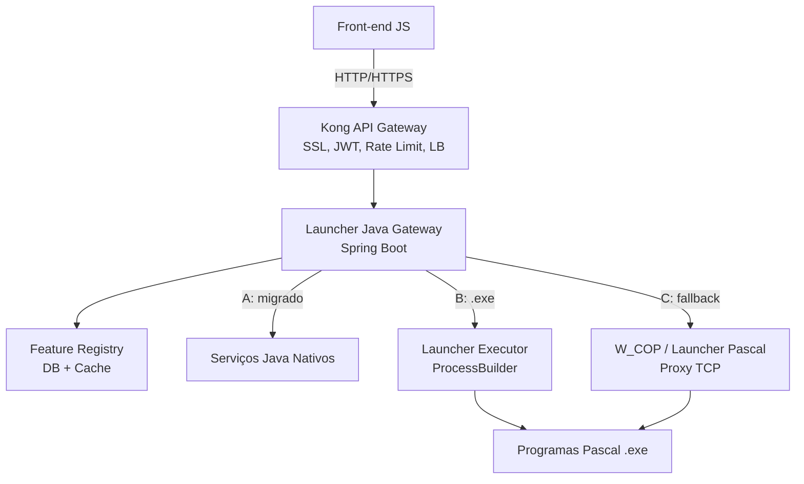

# DOCUMENTO TÉCNICO DE ALTO NÍVEL
PROJETO LAUNCHER JAVA (MIGRAÇÃO/MODERNIZAÇÃO)

(KONG + LAUNCHER JAVA GATEWAY + STRANGLER PATTERN + FEATURE FLAGS)

## 0. Visão Geral da Arquitetura Consolidada

### 0.1 Objetivo
Migrar o launcher legado (Pascal / W_COP) para uma arquitetura baseada em **Java (Spring Boot)** com roteamento inteligente, alta disponibilidade, retrocompatibilidade e escalabilidade, permitindo transição **gradual e reversível** sem breaking changes no front-end.

### 0.2 Fluxo legado (antes)
Front-End (JS) ? W_COP (Pascal, Proxy TCP/Socket) ? Launcher Pascal ? Programas Pascal (.exe)
```
- Comunicação por sockets TCP
- Alta complexidade, baixa observabilidade e escalabilidade limitada
### 0.3 Fluxo novo (consolidado)
```
Front-End (JS)
    ? HTTP/HTTPS
[Kong API Gateway]
    ? Load Balancing, Auth JWT/OAuth2, Rate Limit, Logs, SSL
[Launcher Java Gateway/Proxy] (Spring Boot)
    ????????????????????????????????????????????????????
 [A] Serviço     [B] Executor          [C] Proxy Legacy
     Java Nativo     Pascal (.exe)          W_COP / Launcher Pascal
     (migrado)       (ProcessBuilder)       (TCP ? fallback)
                          ?
                 Programas Pascal (.exe | legado)
```
O **roteador interno** decide em tempo de execução, de forma transparente para o front-end, usando **feature flags** e tabela de mapeamento (`wTela` / método / ambiente /  usuário).

| Rota | Quando | Destino |
|------|--------|---------|
| **(A) Java Nativo** | Funcionalidade já migrada (`isNativeJava(wTela)`) | Serviço Spring Boot dedicado (fora do launcher) |
| **(B) ProcessBuilder** | Programa Pascal puro ainda em uso | Executável via `ProcessBuilder` (parâmetros CLI / arquivo temporário) |
| **(C) Proxy Legacy** | Fallback / rollout incompleto / regressão | Proxy TCP para W_COP / launcher Pascal legado |

### 0.4 Princípios arquiteturais

| Princípio | Descrição |
|-----------|-----------|
| **Transparência ao front-end** | Front-end sempre chama o mesmo endpoint; roteamento é decisão do backend |
| **Strangler Fig** | Migração função a função; convivência segura entre legado e novo |
| **Feature flags** | Rollout gradual (canary/blue-green), rollback instantâneo |
| **Zero breaking change** | Sem alteração destrutiva em tabelas legadas na Fase 1 |
| **Desacoplamento de negócio** | Regras de negócio novas em microserviços; launcher orquestra |
| **Observabilidade desde o dia 1** | `request-id`, métricas Java vs Pascal, logs centralizados |

### 0.5 Diagrama


## 1. Requisitos Funcionais (RF)
### RF01 ? Autenticação Centralizada e Segura
- Login único via banco de dados (login BD) na **Fase 1/MVP**
- Exclusão de métodos inseguros (hash fixo, protocolos legados inseguros) no escopo inicial
- Validação de credenciais com hash moderno (**bcrypt + salt**) para fluxo Java nativo
- Compatibilidade temporária com hash legado (MD5-crypt) **somente** nas rotas (B) e (C), até descomissionamento
- APIs REST: `/v1/login`, `/v1/logout`, validação de sessão
- Logout explícito e expiração automática de sessão
- Proteção anti-brute-force (limite de tentativas / tempo)
- JWT validado no **Kong**; sessão de aplicação validada no **Launcher Gateway**

### RF02 ? Controle de Sessão
- Uma sessão ativa por usuário (impede múltiplos logins simultâneos)
- Sessão com TTL configurável
- Persistência e auditoria em tabela de sessões
- Logout automático ao efetuar novo login
- Validação de sessão **obrigatória** em cada requisição ao Gateway
- Cache distribuído (Redis) para sessões entre instâncias stateless

### RF03 ? Controle de Permissões e Autorizações
- Permissões granulares (roles, privilégios, objetos/operações)
- Endpoints executados somente com permissão válida
- API para consulta de permissões do usuário logado
- Cache híbrido (Caffeine local + Redis) para lookup de permissões e `wTela`

### RF04 ? Gateway de Execução e Roteamento Inteligente
- **Endpoint único** para o front-end: `POST /api/launcher/execute` (versionável: `/v1/...`)
- Roteamento transparente conforme feature flag:
  - **(A)** Serviço Java nativo
  - **(B)** Programa Pascal via `ProcessBuilder`
  - **(C)** Proxy para W_COP / launcher Pascal legado
- Consulta ao **Feature Registry** (banco + cache) por `wTela`, usuário, ambiente e percentual de rollout
- Propagação de `request-id` e contexto (usuário, ambiente, sessão) para todos os destinos

### RF05 ? Lançamento de Programas Legados (Rota B)
- Orquestração segura via `ProcessBuilder`
- Parâmetros por linha de comando e/ou arquivo temporário (sem transferência de socket TCP)
- Conversão de encoding UTF-8 ? CP850 quando necessário
- Timeout configurável, captura de stdout/stderr, exit code
- Log detalhado: parâmetros, timestamps, userId, duração
- Variáveis de ambiente conforme `launcherenv.ini` legado
- Limpeza de arquivos temporários (upload)

### RF06 ? Proxy Legacy (Rota C)

- Proxy TCP/HTTP para W_COP quando feature flag indicar fallback
- Retrocompatibilidade total durante rollout; nenhuma mudança no front-end
- Rollback imediato em caso de regressão (flag ? 100% legado)
- Métricas comparativas Java vs Pascal por rota

### RF07 ? APIs REST Padronizadas
- Versionamento (`/v1/login`, `/v1/launcher/execute`, etc.)
- Respostas JSON padronizadas (`success`, `message`, `data`, `requestId`)
- Retrocompatibilidade temporária: erros de negócio podem retornar HTTP 200 com `success: false` (conforme acordado com front-end)
- OpenAPI/Swagger documentado

### RF08 ? Upload de Arquivos
- Uploads pequenos via `multipart/form-data` (Spring Boot)
- Arquivos grandes (>10 MB): URL pré-assinada S3; backend recebe apenas ponteiro/URL
- Sem payload binário pesado no corpo da requisição de execução

### RF09 ? Observabilidade e Auditoria
- Healthcheck (`/actuator/health`)
- APIs de admin: sessões ativas, status de componentes, métricas de rollout
- Auditoria persistente: logins, execuções, falhas, roteamento (A/B/C)
- Dashboards Prometheus/Grafana para comparação Java vs Pascal

### RF10 ? Gerenciamento de Dados Comuns (Domínios)

- APIs para UF, cidades, estado civil, etc.
- Cache híbrido (Caffeine + Redis) com TTL curto e invalidação pub/sub
- Implementação preferencial em **serviços Java nativos (Rota A)**, não no launcher

### RF11 ? Feature Registry e Rollout

- Tabela de flags: por usuário, por `wTela`, por ambiente, global com percentual
- Rollout gradual (canary/blue-green)
- Rollback instantâneo sem deploy
- APIs de gestão/admin do registry (protegidas)

---
## 2. Requisitos Não Funcionais (RNF)
### RNF01 ? Performance

- Login e execução: p95 < 200 ms (rotas A e domínios)
- Rota B (ProcessBuilder) e C (proxy): SLA separado, documentado por tipo de programa
- Capacidade: 1000+ req/s com escalabilidade horizontal
- Cache para lookup de `wTela`, sessões e permissões

### RNF02 ? Segurança
- HTTPS obrigatório (terminado no Kong)
- Rate limiting por IP/usuário (Kong + Spring Security)
- Headers: HSTS, CSP, X-Frame-Options
- `PreparedStatement`, validação/sanitização de entradas
- Session ID único; expiração/renovação controlada
- Auditoria completa de operações sensíveis

### RNF03 ? Escalabilidade
- Launcher Gateway **stateless**; múltiplas instâncias atrás do Kong
- Cache local (Caffeine) + distribuído (Redis/ElastiCache)
- Deploy em Docker; preparado para ECS/EKS/Kubernetes (Fase 4)

### RNF04 ? Disponibilidade
- SLA uptime > 99,9% durante rollout
- Healthcheck automatizado (Kong + Actuator)
- Rollback via feature flag sem downtime
- Alertas ativos (KPIs Java vs Pascal)

### RNF05 ? Manutenibilidade
- Arquitetura modular (Clean Architecture / SOA)
- Cobertura de testes > 80% (unitário, integração, E2E, carga)
- CI/CD (GitHub Actions), blue/green/canary
- Documentação macro/micro com diagramas

### RNF06 ? Observabilidade
- Logs estruturados JSON (ELK)
- Métricas Prometheus; dashboards Grafana
- `request-id` correlacionado: Kong ? Gateway ? destino (A/B/C)
- Logging detalhado de cada request e execução legada

### RNF07 ? Auditoria
- Tabelas de sessões e tentativas de login
- Histórico de acessos, falhas e bloqueios: mínimo 90 dias
- Registro da rota escolhida (A/B/C) por requisição

### RNF08 ? Compatibilidade Temporária
- Fallback para W_COP (Rota C) durante toda a Fase 1 e início da Fase 2
- Adaptações mínimas na biblioteca Pascal: aceitar parâmetros CLI/arquivo (sem socket herdado)
- Encoding Java ? Pascal mapeado e testado

## 3. Decisões de Arquitetura Técnica (O COMO)
### DA01 ? Camadas e Responsabilidades

| Camada | Tecnologia | Responsabilidade |
|--------|------------|------------------|
| **Borda** | Kong Open Source | SSL, JWT/OAuth2, rate limit, LB, logs, healthcheck |
| **Gateway** | Spring Boot | Roteamento A/B/C, sessão, permissões, feature flags |
| **Executor** | Spring Boot (módulo) | ProcessBuilder, TLV/CLI, timeouts, logs de processo |
| **Proxy Legacy** | Spring Boot (módulo) | Ponte para W_COP / launcher Pascal TCP |
| **Negócio** | Microserviços Spring | Login BD, domínios, contratos, leads ? **fora** do launcher |
| **Cache** | Caffeine + Redis | Sessão, permissões, `wTela`, feature flags |
| **Dados** | Firebird/legado + novas tabelas | Sessões, flags, auditoria (sem breaking change em tabelas críticas) |

### DA02 ? Stack Backend
- Spring Boot + Tomcat embarcado
- Spring Security + validação JWT (Kong como emissor/validador na borda)
- Redis/Caffeine para cache híbrido
- Spring Actuator (health, métricas, info)
- OpenAPI/Swagger

### DA03 ? Organização do Código (pacotes)
```
com.empresa.launcher
??? api/              // REST Controllers (/v1/login, /v1/launcher/execute)
??? gateway/          // Roteador A/B/C, FeatureFlagResolver
??? auth/             // Autenticação, sessão, permissionamento
??? legacy/
?   ??? executor/     // ProcessBuilder, TLV, encoding CP850
?   ??? proxy/        // Cliente TCP para W_COP
??? feature/          // Feature Registry (repository, service, cache)
??? domain/           // Modelos de domínio
??? service/          // Orquestração (não regras de negócio de contrato/lead)
??? config/           // Spring Boot, Security, Redis, Kong headers
??? infra/            // Logging, métricas, cache, auditoria
??? util/             // Helpers (encoding, request-id)
??? test/             // Testes automatizados
```

### DA04 ? Padrão de Roteamento (Strangler)
```java
// Pseudocódigo conceitual
RouteDecision route(ExecuteRequest req) {
    if (featureRegistry.isNativeJava(req.getWTela(), req.getUser(), req.getAmbiente()))
        return RouteDecision.NATIVE_JAVA;      // A
    if (featureRegistry.isLegacyProxyRequired(req))
        return RouteDecision.LEGACY_PROXY;     // C
    return RouteDecision.PROCESS_BUILDER;      // B (default para programas Pascal)
}
```
Ordem de precedência sugerida: **flag de fallback global (C)** ? **nativo (A)** ? **ProcessBuilder (B)**.

### DA05 ? Execução Legada (Rota B)
- `ProcessBuilder` com argumentos CLI e/ou arquivo temporário
- Protocolo TLV via stdin/stdout (compatível com programas `loginXXX` / SCCI)
- Sem handoff de socket TCP (mudança acordada na biblioteca Pascal)
- UTF-8 ? CP850 configurável por ambiente

### DA06 ? Proxy Legacy (Rota C)
- Cliente TCP para W_COP replicando contrato esperado pelo front-end atual
- Ativado por feature flag (usuário piloto, `wTela`, percentual, kill-switch global)
- Métricas dedicadas para comparar latência/erro com rotas A e B

### DA07 ? Segurança
- Kong: autenticação na borda
- Spring Security: autorização, sessão, CORS, headers
- Rate limiting e lockout no Gateway
- Upload grande via S3 pré-assinado

### DA08 ? Deploy e Infraestrutura

| Fase | Infra |
|------|-------|
| Fase 1 (MVP) | On-premise ou VM; Kong + 1+ instâncias Launcher Java; Redis opcional |
| Fase 2?3 | Múltiplas instâncias; Redis obrigatório; staging + blue/green |
| Fase 4 | Docker, ECS/EKS/Kubernetes; Redis gerenciado; observabilidade full |

### DA09 ? Observabilidade

- Logs JSON ? ELK
- Métricas ? Prometheus ? Grafana
- Dashboard de rollout: % requisições A vs B vs C, erros, p95 por rota

## 4. Relação com o Código Atual (MVP `scci-backend-java-main`)
O repositório atual é um **protótipo inicial**, não a arquitetura consolidada:
| Aspecto | Código atual | Arquitetura consolidada |
|---------|--------------|-------------------------|
| Framework | `HttpServer` nativo Java | Spring Boot |
| Gateway | Não existe | Kong + Launcher Gateway |
| Roteamento A/B/C | Não existe | Feature Registry + Router |
| `/login` | Fluxo Java fixo (Firebird + MD5-crypt) | Serviço auth separado + bcrypt |
| Demais rotas | `DefaultHandler` ? ProcessBuilder | Rota B formalizada no Executor |
| Proxy W_COP | Não existe | Rota C |
| Feature flags | Não existe | Tabela + cache Redis |
| Observabilidade | `System.out` | Actuator + Prometheus + ELK |

**Reaproveitável como referência:** `Pcrypt`, `LauncherEnvReader`, protocolo TLV do `DefaultHandler`, `FirebirdUserReader` (adaptar para Spring + bcrypt).
---
## 5. Roadmap / Fases da Migração
### Fase 1 ? Gateway e Launcher Java (MVP)
- [ ] Kong configurado (SSL, JWT, rate limit, LB)
- [ ] Launcher Java Gateway com endpoint `/v1/launcher/execute`
- [ ] Feature Registry (tabela + cache)
- [ ] Rota **C** (proxy W_COP) como default para produção
- [ ] Rota **B** (ProcessBuilder) para programas piloto
- [ ] Login BD em Java (Rota A parcial) para usuários piloto
- [ ] Observabilidade básica (health, logs, request-id)
- [ ] Front-end **sem alteração** (mesmo contrato HTTP)

### Fase 2 ? Primeiras funcionalidades Java nativas

- [ ] Migrar telas/fluxos (lead, contrato, domínios) para serviços Java (Rota A)
- [ ] Rollout gradual por `wTela` com métricas Java vs Pascal
- [ ] Cache híbrido completo (sessão, permissões, domínios)
- [ ] Upload S3 para arquivos grandes

### Fase 3 ? Descomissionamento do legado
- [ ] Rollout até 100% nas rotas A e B
- [ ] Rota C desativada por feature flag
- [ ] W_COP e launcher Pascal removidos após período de observação

### Fase 4 ? Otimizações cloud
- [ ] Containers (ECS/EKS/Kubernetes)
- [ ] Redis gerenciado, logs centralizados, alertas
- [ ] Auto-scaling do Launcher Gateway

## 6. Escopo Negativo (Fase 1)
**Não será atacado agora:**
- Logins customizados por cliente (Itaú, Sicoob, etc.) ? Fase 2+
- Integrações bancárias além do login BD padrão
- Migração completa de todos os payloads legados
- APIs de clientes externos fora da arquitetura padrão
- Protocolos legados inseguros (hash fixo, ofuscação como segurança)
- Monitoração além do stack acordado (Kong, Prometheus, Grafana, ELK)

---
## 7. Pontos em Aberto / Para Discussão
| # | Tema | Impacto |
|---|------|---------|
| 1 | Login/protocolo especial para algum cliente na Fase 1? | Escopo Rota C vs A |
| 2 | Quanto do código MVP (`scci-backend-java-main`) será reaproveitado vs reescrito em Spring? | Esforço Fase 1 |
| 3 | Grau de compatibilidade de payload na Fase 1 (CCP binário vs JSON)? | Contrato front ? Gateway |
| 4 | Tempo de paralelismo W_COP + Java | Custo operacional |
| 5 | Infra final: on-prem obrigatório ou cloud desde Fase 1? | Kong, Redis, S3 |
| 6 | Matriz completa de encoding UTF-8 ? CP850 por programa | Rota B |
| 7 | Ordem de precedência exata das flags (kill-switch global vs canary por tela) | Comportamento em regressão |
| 8 | Migração de hash MD5-crypt ? bcrypt: estratégia (rehash no login, batch, convivência) | RF01 |

---

## 8. Riscos e Mitigações
| Risco | Mitigação |
|-------|-----------|
| Perda/duplicidade de sessão em cluster | Redis + constraint UNIQUE + triggers |
| Regressão em produção | Rota C (fallback W_COP) + rollback por feature flag |
| Perda de performance | Cache híbrido, testes de carga, SLA por rota |
| Incompatibilidade Pascal (sem socket) | Adaptação validada na biblioteca Pascal; POC Rota B |
| Bug crítico no Gateway | Blue/green, canary, dashboards Java vs Pascal |
| Sessão stateless vs ProcessBuilder stateful | Executor isolado; contexto via arquivo/env, não memória local |

---
## 9. KPIs de Sucesso
| KPI | Meta |
|-----|------|
| Incidentes graves de segurança | Zero em produção |
| Sessões duplicadas | 0% |
| Login p95 (Rota A) | < 200 ms |
| Uptime durante rollout | > 99,9% |
| Cobertura de testes | > 80% |
| Satisfação usuário (30 dias pós-rollout) | > 90% |
| Auditoria de ações sensíveis | 100% |
| Rollback por feature flag | < 5 min |

## 10. Gestão e Documentação
- Artefatos centralizados (Google Drive Engenharia)
- Rastreabilidade: skate/issue/EVP
- Comunicação: espaço Google Chat do projeto
- Este documento + blueprint detalhado + specs por sprint em `docs/specs/`

---

## 11. Próximos Passos Imediatos
1. Validar este documento (v2.0) em coletiva
2. Responder pontos em aberto (seção 7)
3. Gerar **blueprint arquitetural detalhado** (classes, sequências A/B/C, modelo de dados do Feature Registry)
4. POC: Rota C (proxy W_COP) + Rota B (ProcessBuilder) + flag simples
5. Definir contrato único `POST /v1/launcher/execute` com o time de front-end
6. Setup ambiente local: Kong + Spring Boot + Redis
7. Mapear `wTela` ? decisão de rota (planilha inicial de rollout)
---
## 12. Conclusão
A arquitetura consolidada posiciona o **Launcher Java Gateway** como **fachada inteligente** (Strangler Fig), não como monólito de negócio. O Kong cuida da **borda**; o Gateway decide entre **Java nativo (A)**, **ProcessBuilder (B)** e **proxy W_COP (C)** via feature flags, com cache distribuído e observabilidade para rollout seguro.
Este documento alinha os requisitos funcionais e não funcionais à arquitetura acordada em reunião e serve de base para o blueprint detalhado e o backlog de sprints.

-
# DOCUMENTO TÉCNICO DE ARQUITETURA UNIFICADO
## PROJETO LAUNCHER JAVA (MODERNIZAÇÃO/STRANGLER/FEATURE FLAGS/KONG)

### 0. Visão Geral Consolidada

**Objetivo**  
Realizar a migração do launcher legado (Pascal/W_COP) para uma solução moderna com Java (Spring Boot), Kong API Gateway e arquitetura Strangler Pattern baseada em feature flags, garantindo:
- Roteamento inteligente entre versões (Pascal legado, executor Java, serviços Java nativos)
- Alta disponibilidade, observabilidade e escalabilidade horizontal
- Retrocompatibilidade total com o front-end (sem breaking changes)
- Transição gradual, reversível, seguro por rollout de feature flags

---

#### 0.1 Fluxos de Execução

**ANTES:**
```plaintext
Front-End (JS)
   ? TCP
W_COP (Pascal, Proxy)
   ? TCP
Launcher Pascal
   ?
Programas Pascal (.exe)

DEPOIS (Consolidado):
mermaidflowchart TD
Front[Front-end JS]
Kong[Kong API Gateway<br/>SSL, JWT/OAuth2, Rate Limit, LB]
GW[Launcher Java Gateway/Proxy]
Registry[Feature Registry (DB+Cache)]
Native[Serviços Java Nativos]
Executor[Launcher Executor (ProcBuilder)]
Legacy[Proxy W_COP/Launcher Pascal]
Programas[Programas Pascal .exe]

Front -->|HTTP/HTTPS| Kong
Kong --> GW
GW --> Registry
GW -->|A: migrado| Native
GW -->|B: .exe| Executor
GW -->|C: fallback| Legacy
Executor --> Programas
Legacy --> Programas

Roteamento Interno: O gateway Java decide, via feature flag + tabela de mapeamento (
wTela
 / endpoint / usuário / ambiente), entre:
(A) Serviço Java Nativo (
isNativeJava(wTela)
)
(B) Executor ProcessBuilder Java (chama um .exe Pascal com novos parâmetros CLI/arquivo)
(C) Proxy Legacy para W_COP/launcher Pascal (fallback/rollback transparente)
Princípios: Transparência, Strangler (migração segura função-a-função), feature flags, rollback instantâneo, desacoplamento de negócio, observabilidade e alta disponibilidade.

1. Unificação dos Entendimentos ? Requisitos Técnicos1.1 Login e Sessão

Catálogo de Estados de Login: Formalizar todos os desfechos possíveis vindos do launcher (sucesso, senha errada, bloqueio, expirada, captcha obrigatório, usuário inativo, erro de permissão, resposta de saúde, etc.) padronizando respostas da API (
enum
 ou problem+json).

Fluxos de Troca de Senha: Diferenciar:
Expirada
Obrigatória
Temporária (com contagem de dias restantes)
Aviso de expiração iminente (alerta antes do bloqueio)


Bloqueio Progressivo em 2 níveis:
1º nível: exige captcha após X erros
2º nível: bloqueia usuário após novo limite
Dois contadores: atual (memória/processo) e histórico (persistente)

Persistência de Estado da Sessão: Redis (& banco); session token real e separado da senha.

Configuração de Logins Simultâneos: Quantidade máxima de sessões por usuário/ambiente deve ser parâmetro, não fixo em 1. Validado no 
loginbd
.
Atraso Proposital e Mensagens Indistinguíveis (Hardening):
Atraso programático em todas as respostas de login falho
Mesma resposta para "usuário inexistente" e "senha incorreta"
Histórico de Senhas: Evitar reuso das últimas N senhas (implementar tabela/acompanhamento de hashes).

1.2 Permissões & Autorização

Permissão Granular: Por operação/método, não apenas por usuário; 403 para métodos não permitidos.
Validação de Ambiente Operacional: Ambiente determina regras, roteamento, usuário/grupo SO e variáveis. Alimentar Feature Registry com tabela de ambientes legados.
Validação de permissão/separação de criptografia de entrada: Solicitações criptografadas (AES) ? obrigatório decifrar no launcher antes de processar (não quebrar front). Resposta pode aproveitar TLS, descontinuar ofuscação leve.

1.3 Sessão & Auditoria
Estado completo da sessão: Usuário, chave/token, IP, último uso, contadores de erro, ambientes.
Timeout de inatividade: Forçar reentrada de senha após tempo X inativo (configurável).
Eventos de sessão e logins: Chamada a programas externos, que podem ter efeito colateral de negócio ? antes de modernizar, mapear quem consome esses eventos.

1.4 Gateway e Roteamento

Endpoint Único: 
POST /api/launcher/execute
 ? roteamento inteligente A (Java nativo), B (.exe), C (Proxy).

Roteamento e Feature Flags:
Feature Registry por usuário, tela, ambiente, rollout percentual
Ordem de precedência: flag de fallback global ? nativo ? ProcessBuilder
Retrocompatibilidade: Nenhuma alteração destrutiva nas tabelas legadas; não mudar contrato com o front. Possibilidade de rollback instantâneo trocando feature flag.
Proxy W_COP por fallback em produção inicial (kill-switch global).

1.5 Processamento Legado (.exe)
Execução via 
ProcessBuilder
:
CLI e/ou arquivo temporário, sem handoff TCP
Timeout, captura de stdout/stderr/exit code
Suporte a TLV via stdin/stdout (para programas como loginxxx/scci)
Variáveis de ambiente herdadas (
launcherenv.ini
)
Conversão de encoding UTF-8 ? CP850
Arquivos temporários de upload limpos ao final
Adoção de isolamento de execução via SO/containerização, para manter identidade/perm de arquivos conforme ambiente
Adaptação mínima na biblioteca Pascal: aceitar parâmetros CLI/arquivo, sem socket herdado

1.6 Uploads e Arquivos
Uploads pequenos: 
multipart/form-data
 no endpoint REST.
Uploads grandes (>10MB): S3 pré-assinada, apenas URL/pointer trafega.
Download: Autorização + rastreabilidade via REST.
Controle de versionamento e limite de tamanho.

1.7 Observabilidade e Logging

request-id de ponta a ponta.
Logs estruturados (JSON via ELK), métricas Prometheus/Grafana.
Auditoria formal: logins, execuções, falhas, roteamento A/B/C.
Dashboards comparativos Java vs Pascal.
Compatibilidade/modernização dos logs: por padrão JSON estruturado, decisão compartilhada se mantém logs legados em 
/var/log/launcher/accesslog.*
 ou migra direto.

1.8 APIs REST Padronizadas

Versionamento
Padronização no retorno (
success
, 
message
, 
data
, 
requestId
), erros podem retornar HTTP 200/400 (transição)
Swagger/OpenAPI documentado
Healthcheck, status/admin

1.9 Segurança

HTTPS obrigatório (terminação no Kong)
JWT/OAuth2 na borda pelo Kong
Spring Security: autorização, proteção CSRF, CORS, headers como HSTS, CSP
Rate limiting e bloqueio no Gateway
CAPTCHA e proteção anti-brute-force (usuário, IP)
Recuperação de senha por e-mail, token expira após uso/tempo
Políticas de senha (complexidade, blacklist, histórico)
Constância de tempo em comparação de senhas
Upload restrito/importante em endpoints dedicados

2. Pontos Técnicos Especiais da Base Pascal (da revisão de launcher.pas, loginbd.pas, wcorp.pas)

Login:
Catálogo formal de estados/respostas tratado via enum + API (não só success|fail).
Bloqueio progressivo, dois contadores: uso do Redis para estado persistente/distribuído.
Tempo constante e mesma mensagem p/ login fail: explicitado nos requisitos funcionais e não-funcionais.
Histórico de senha: tabela de hashes, bloqueio de reuso.
Três fluxos de troca de senha e alerta de expiração iminente.
Limite de sessões simultâneas: agora configurável, não fixo.
Execução/identidade por ambiente: processos rodam com usuário/grupo OS próprio ? prever isolation via ProcessBuilder/container.
Eventos externos (programas executados ao logar/trocar senha/logoff): investigar se precisam manter ou migrar execução para log estruturado.
Recarga de configuração a quente e política de invalidação de cache (global/seletiva/por usuário).
Permissões por método/autorização por operação (não apenas usuário).
Validação do ambiente determina roteamento (Feature Registry).
Criptografia real na entrada (AES) ? manter descriptografia no launcher.
Respostas não são simples: Blocos complexos (status, dados, exceptions, progresso, compressão), adaptar API para respeitar padrão, inclusive transporte de exceção padronizado no Problem+JSON (RFC 7807).
Lista de operações proibidas para usuário web genérico ? decidir se centraliza no launcher ou mantém na camada Pascal.
Respeito ao oserver: e sua estrutura de blocos na transição.
Admin (comando para encerrar processos, recarregar config/limpar cache, healthcheck): decidir o que mantém, tira ou reexpõe numa camada admin.

3. Decisões Técnicas Consolidadas

API Gateway: Kong (SSL, autenticação na borda, rate limiting, healthcheck)
Roteamento: Gateway Java (Spring Boot), consulta feature registry (DB + Redis cache), prioridade: kill-switch global ? Java nativo ? ProcessBuilder ? fallback
Process execution: isolado, parametrização via CLI/arquivo, ambiente/deployment separando permissões/identidade
Cache: Redis obrigatório para estado de sessão, permissões, wTela, flags; Caffeine local como cache L1
Logging/observabilidade: ELK full, Prometheus/Grafana, dashboard rollout
Sessão: Estado e auditoria persistidos, expiração configurável, chave/token autêntica, número de sessões por usuário/ambiente parametrizável
Feature flags: Rollout gradual, fallback, trap de regressão, kill-switch global, rollback < 5 min
Segurança: JWT/OAuth2, senha forte, CAPTCHA progressivo, proteção contra enumeração de usuário, encoding, audit trail de operações sensíveis
Uploads: REST (pequenos), URL S3 (grandes), size limit e versionamento
Admin: APIs para admin/monitoramento (sessões ativas, kill session, reload config, health)
Compatibilidade temporária: Proxy W_COP pode ser mantido até descomissionamento total

4. Prioridades de Migração Fase 1

Priorização:
Catálogo formal de estados de login e tratamento de sessão (com externalização de estado em Redis)
Implementação de bloqueio progressivo com dupla contagem e persistência
Retorno padronizado de mensagens de login/troca de senha na API (problem+json)
Execução legada de processos .exe parametrizada (com isolamento)
Roteamento seguro e transparente via feature flags
Logging e tracking de requisições ponta-a-ponta

5. Considerações e Backlog

Fase 1: Apenas login BD padrão (cliente único), sem logins federados/JWT/SAML (ficam p/ Fase 2)
Backlog: logins customizados/integrados, assinatura/mensagem, token de integração server-to-server, roteamento de login por prefixo, templates de e-mail, compressão de resposta, SSE/progress status
Importante: Revisar o que é efeito colateral de login/logoff/troca via execução de programas externos (passar para logging ou manter hook)
Manter: contrato de interface (?minimal invasive?) para programas Pascal legados

6. Pontos Em Aberto (Resumidos)

Decidir ordem exata de precedência das feature flags para fallback/migração
Definir matriz de encoding/codificação por programa/processo
Detalhar payload e tratamento de blocos do protocolo legado (CCP, compressão, status/progresso)
Validar o mínimo necessário de customização na biblioteca Pascal (.exe)
Adotar política de rollout/rollback segura e monitorada


7. Roadmap/Próximos Passos

Validar esse documento (base para o blueprint e backlog)
Responder os pontos em aberto (fit-for-purpose Fase 1)
Produzir blueprint técnico/detalhado com diagramas de sequência, modelo de dado do Feature Registry, tabelas de decisão para roteamento
POC mínima: Rota B+C, proxy e parametrização, feature flag global simples
Definir contrato de execução (
/v1/launcher/execute
) e catálogo formal de estados de login/troca/bloqueio (sheet/document)
Setup local de stack (Kong, Gateway, Redis) para integração, testes e quick wins
Validar tabela de mapeamento (
wTela
) + ambiente operacional ao Feature Registry
Publicar esse unificado no Drive com rastreabilidade do skate/ticket

8. Conclusão

Esse documento unifica os entendimentos arquiteturais, técnicos e de negócio do frontend ao launcher, sequenciando as decisões críticas, backlog e ações de Fase 1. Os próximos passos devem priorizar login/session (com externalização de estado), retrocompatibilidade, roteamento seguro, e rollout monitorado. O status de cada ponto deve ser registrado na documentação viva e revisitado a cada sprint/marco.

Priorização para Fase 1:
Catálogo de login detalhado
Externalização de estado de sessões/bloqueios
Roteamento transparente via feature flag
Manter integração mínima na biblioteca Pascal (sem quebra)

-
